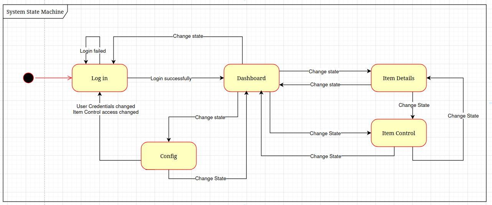
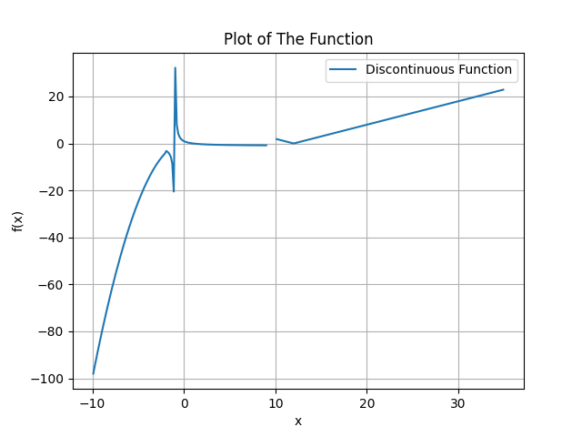

# Irdeto_sw_tasks

## API Design and API Test Design
### REST API Endpoints

| Endpoint                         | Method | Description                                      | Request Body Example                        |
|----------------------------------|--------|--------------------------------------------------|---------------------------------------------|
| `/myapi/login/`                        | POST   | Log in a user                                   | `{ "username": "admin", "password": "1234" }`|
| `/myapi/state/`                        | GET    | Get the current system state                    | —                                           |
| `/myapi/state/`                        | POST   | Change the system state                         | `{ "new_state": "Dashboard" }`              |
| `/myapi/items/`                        | GET    | List items (supports `page`, `page_size`, `sort`, `state`) | —                                           |
|                                  |        | Example(/items/?page=1&page_size=5&sort=desc&state=run) |                                     |
| `/myapi/items/?id=`                        | GET    | List item by id. Example(/items/?id=hbo)| —                                           |
| `/myapi/items/`                        | POST   | Create a new item                               | `{ "id": "A", description": "Item A"}`|
| `/myapi/items/<item_id>/state/`       | PUT    | Change the state of a specific item             | `{ "state": "pause" }`                      |
| `/myapi/user/`                         | PUT    | Update user credentials                         | `{ "username": "new_user", "password": "new_pass" }`|
| `/myapi/item-control/`                | PUT    | Allow or deny item control access               | `{ "allowed": true }`                       |

### State transition diagram

### Run the demo
1. `cd api_mvp/`
2. Run server `python manage.py runserver` 

run tests `python manage.py test`

### Explanation
I used Django to build a web app and implement the API

## Unit Testing

Run tests: `pytest Math_function/test_discontinuous_function.py`

## DASH Parsing and Validation

Run code: `python3 period_checker/period_validity.py`
